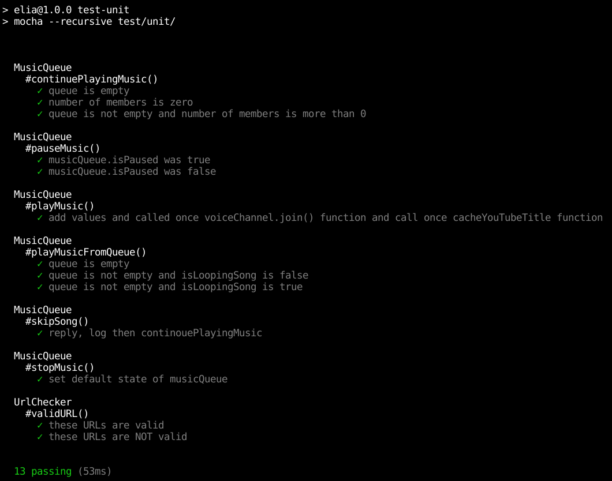

# Unit tesztelés

A feladat során a Mocha.js és a Sinon.js JavaScript teszt keretrendszereket használtuk fel.

A tesztek írása során használtuk ezen keretrendszerek mock, spy, stub és assert funkcióit.
Az egységtesztek főként a forráskód zenelejátszásávaal kapcsolatos részeit tesztelik, valamint a bot URL címeket ellenőrző függvényét.

A tesztek lefutattása a következő paranccsal lehetséges:

``` npm run unit-test ```

A tesztek futásának eredménye:



A kapcsolódó Github issue: [#1](https://github.com/BME-MIT-IET/iet-hf2021-elia/issues/1)